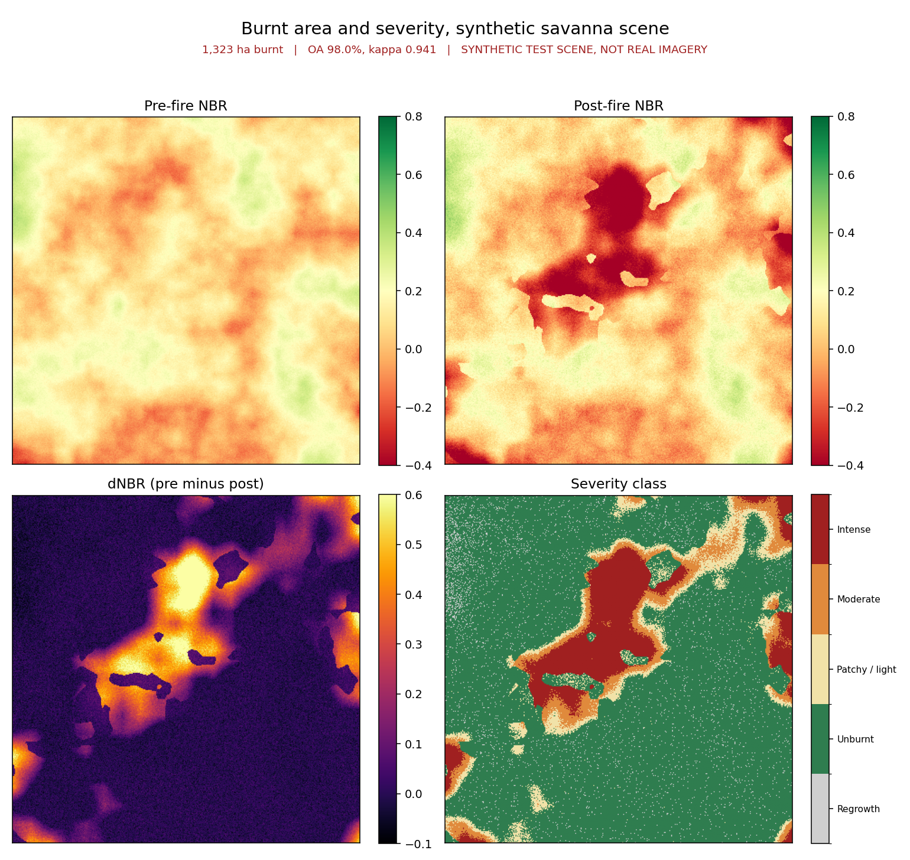
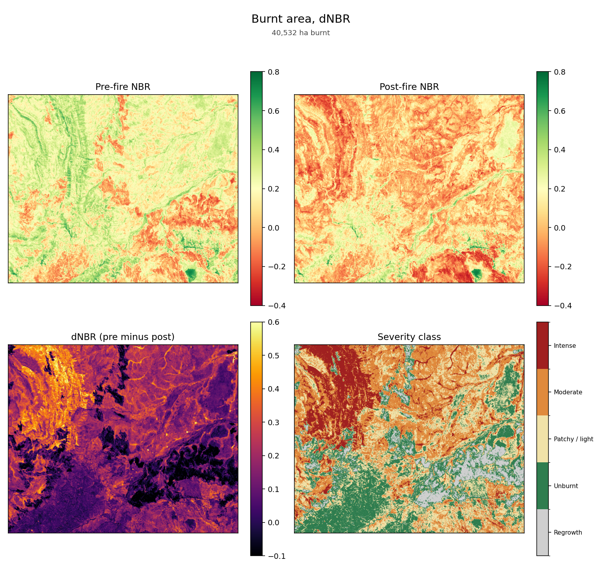

# savanna-burn-mapper

Burnt-area and burn-severity mapping from Sentinel-2 imagery using dNBR, with
severity breakpoints adjusted for northern Australian savanna.

CPU only. No GPU, no cloud account, no API key. It maps a 1-megapixel scene in
about a third of a second on an ordinary laptop, and the whole test suite runs
in under a second.



> The figure above was produced by `burnmapper demo`, which runs on a
> **synthetic test scene, not real satellite imagery**. See
> [Synthetic scenes](#synthetic-scenes) for why that exists and what it is and
> is not good for.

## Why savanna needs its own breakpoints

The standard dNBR severity table (Key and Benson, 2006) was derived from
North American forest fires, where a severe fire kills the canopy. Northern
Australian savanna burns differently: most fires are fast surface fires that
consume grass and leaf litter, scorch the understorey, and leave the tree
canopy alive. They register far lower on dNBR.

Apply the USGS table unchanged to a savanna scene and almost everything lands
in "unburnt" or "low severity", which throws away the variation that actually
matters to a land manager deciding where to burn next year. This package ships
both tables and defaults to the savanna one.

```python
from burnmapper import SEVERITY_USGS, SEVERITY_SAVANNA
```

The savanna breakpoints are a pragmatic rescaling, **not** an authoritative
published table. Calibrate them against field observation or NAFI fire-scar
products before trusting them for anything consequential. There is a test that
demonstrates the two schemes disagree on the same scene, which is the point.

## Install

```bash
git clone https://github.com/seemonkumawat1234-arch/savanna-burn-mapper.git
cd savanna-burn-mapper
pip install -e ".[dev]"
```

Three runtime dependencies: `numpy`, `rasterio`, `matplotlib`. No xarray, no
geopandas, no GDAL build step beyond the `rasterio` wheel.

## Use

Run the demo, which needs no data at all:

```bash
burnmapper demo --size 384 --out-dir outputs
```

Run it on real Sentinel-2 bands:

```bash
burnmapper map \
  --pre-b4 pre_B04.tif  --pre-b8 pre_B08.tif  --pre-b12 pre_B12.tif \
  --post-b4 post_B04.tif --post-b8 post_B08.tif --post-b12 post_B12.tif \
  --out-dir outputs
```

All bands must already be on a common grid. The loader refuses to run if the
CRS, transform or shape differ between bands, rather than resampling silently,
because a half-pixel misalignment between the pre and post stacks produces a
dNBR map full of false edges that looks entirely plausible.

As a library:

```python
from burnmapper import load_scene, map_burn, plot_burn_map

scene = load_scene(
    {"B4": "pre_B04.tif",  "B8": "pre_B08.tif",  "B12": "pre_B12.tif"},
    {"B4": "post_B04.tif", "B8": "post_B08.tif", "B12": "post_B12.tif"},
)
result = map_burn(scene, threshold=0.08, out_dir="outputs")
print(result.summary())
plot_burn_map(result, scene, "outputs/burn_map.png")
```

Outputs are `dnbr.tif`, `rbr.tif`, `severity.tif`, `burnt_mask.tif` and a
four-panel PNG. Every GeoTIFF carries the input scene's CRS and transform, so
they drop straight into QGIS or ArcGIS Pro.

## A real scene

The figure above is synthetic. Here is the same pipeline on real Sentinel-2
imagery, over the Arnhem Land plateau in Kakadu, Northern Territory.



| | |
|---|---|
| Pre-fire scene | `S2C_53LKF_20250530_0_L2A`, 30 May 2025, 1.75% cloud |
| Post-fire scene | `S2A_53LKF_20250929_0_L2A`, 29 Sep 2025, 0.10% cloud |
| Area of interest | 132.45 to 132.70 E, 13.30 to 13.10 S |
| Grid | 1120 x 1366 at 20 m, EPSG:32753 (UTM zone 53S), 61,197 ha |
| Runtime | 2.5 s on a laptop CPU, 1.53 megapixels |

Result: **40,532 ha mapped as burnt**, about 66 percent of the scene, split
16,703 ha patchy or light, 19,064 ha moderate and 7,052 ha intense.

Reproduce it:

```bash
python scripts/fetch_sentinel2.py \
    --bbox 132.45 -13.30 132.70 -13.10 \
    --pre 2025-04-15 2025-06-10 --post 2025-08-20 2025-10-20 \
    --out-dir data/arnhem

burnmapper map \
    --pre-b4  data/arnhem/pre_B4.tif  --pre-b8  data/arnhem/pre_B8.tif \
    --pre-b12 data/arnhem/pre_B12.tif \
    --post-b4 data/arnhem/post_B4.tif --post-b8 data/arnhem/post_B8.tif \
    --post-b12 data/arnhem/post_B12.tif
```

`scripts/fetch_sentinel2.py` needs no account and no API key. It searches the
Earth Search STAC API, picks the least cloudy scene in each window, requires
both to come from the same MGRS tile so the grids match, and resamples the
10 m bands down onto B12's native 20 m grid rather than upsampling B12.

### What this result does and does not show

**Internally consistent.** NBR stays inside [-1, 1], the scene median NBR falls
from +0.213 before to +0.031 after, median dNBR is +0.156, class areas sum to
the scene area exactly, and there are no no-data or NaN pixels.

**The pre-fire image already contains burn scars.** Late May was the earliest
clear scene available, and early dry-season burning was already under way by
then. So this measures burning between 30 May and 29 Sep only, and misses the
earliest fires of the season. The visible red patches in the pre-fire NBR panel
are those earlier scars.

**The 4,284 ha of "Regrowth" is real, not an artefact.** Those are areas burnt
before 30 May that had greened up by late September, so their NBR rose and dNBR
went negative. That is what the class is for.

**No accuracy figure is claimed.** There is no reference data for this area and
period here, so overall accuracy and kappa are not reported. Believing the
66 percent figure requires validating it against the North Australia and
Rangelands Fire Information service at https://firenorth.org.au, which publishes
independent fire-scar mapping for this country. Doing that comparison is the
obvious next step and has not been done.

## Method

1. **NBR** = (NIR − SWIR2) / (NIR + SWIR2), from Sentinel-2 B8 and B12.
   Healthy vegetation is NIR-bright and SWIR-dark, so NBR is high. Char and
   exposed soil invert that, so NBR falls sharply.
2. **dNBR** = NBR(pre) − NBR(post). Positive means NBR fell, the direction
   fire pushes it.
3. **RBR** = dNBR / (NBR(pre) + 1.001), from Parks et al. (2014). dNBR is an
   absolute change, so the same fire scores higher over dense pre-fire cover
   than over sparse. RBR divides that out, which matters in savanna where
   cover varies a lot within one scene.
4. **Severity classes** by binning dNBR against the chosen breakpoints.
5. **Burnt mask** by thresholding dNBR, with an optional second condition that
   the post-fire pixel must itself be dark in NBR terms. That condition removes
   a common false positive: a pixel that was very green before the window and
   merely less green after produces a high dNBR without any burning.
6. **Areas** in hectares, from the pixel size in the file's own projection.
7. **Accuracy assessment** against a reference mask when one is supplied.

### Accuracy reporting

The assessment reports the full confusion matrix, overall accuracy, Cohen's
kappa, and per-class producer's and user's accuracy. Overall accuracy alone is
close to useless here: savanna scenes are routinely 80 percent or more
unburnt, so a classifier that predicts "unburnt" everywhere scores 80 percent
while finding no fire whatsoever. There is a test that constructs exactly that
case and asserts kappa is 0 while OA is 0.95.

Producer's accuracy is recall, of the reference burnt pixels how many were
found. User's accuracy is precision, of the pixels mapped burnt how many were
right. They fail in opposite directions and a burnt-area map can look fine on
one while being unusable on the other.

## Synthetic scenes

`synthetic_scene()` generates a savanna scene with a known burn scar, so the
tests, the demo and the accuracy path all run with no download and no account.

It is built to be a hard enough problem to be worth anything:

- Severity **ramps up from zero at the scar edge** rather than switching on.
  A step-change scar is perfectly separable and scores 100 percent, which
  measures nothing. Real scar edges are mixed pixels and that is where nearly
  all the error lives.
- **Unburnt islands** inside the perimeter, which real fires leave.
- Unburnt ground **dries between the two dates**, so dNBR is not zero off-scar
  and the threshold has to do real work.
- A broad **haze gradient**, standing in for imperfect atmospheric correction.
  Spatially correlated error is much harder to threshold around than per-pixel
  noise, and it is what real scenes carry.
- Spatial structure from **multi-octave value noise**, so vegetation patches
  and the scar are landscape-scale. Blurred white noise gives a correlation
  length of two or three pixels, and a scar cut from that is speckle.

On a 384-pixel scene the current generator yields roughly 98 percent overall
accuracy and kappa around 0.94, with detection errors in both directions.

**What it is good for:** exercising the pipeline, regression-testing the maths,
and demonstrating the accuracy machinery against known truth.

**What it is not:** evidence that the method works on real imagery. Synthetic
data cannot validate a remote sensing method, and published dNBR accuracies on
real savanna sit meaningfully below what this generator produces. For a real
scene see [A real scene](#a-real-scene) above. Every file and figure derived
from a synthetic scene is labelled as such, including a `SYNTHETIC_INPUT=1` tag
written into the GeoTIFF metadata, so a raster cannot be mistaken for a real
result after it leaves this process.

## Tests

```bash
pytest
```

41 tests, no network, no data files. They assert domain behaviour rather than
just that the code returns:

- a burnt pixel's NBR must be lower than a vegetated pixel's
- dNBR must be positive when fire reduces NBR and negative for greening
- RBR must separate two fires with identical absolute NBR drop but different
  pre-fire cover, where dNBR cannot
- severity schemes must be gap-free, non-overlapping and ordered
- a zero denominator must return NaN, not 0, so no-data cannot pass as a real
  measurement
- kappa must be 1.0 for perfect agreement and 0.0 at chance level
- the confusion matrix must be reference-rows by predicted-columns, verified
  with an asymmetric single-pixel case
- area figures must convert pixels to hectares correctly (25 pixels of 20 m is
  exactly 1 ha)
- the synthetic provenance tag must survive a GeoTIFF round trip

## Getting Sentinel-2 data

Free, no payment, registration where noted:

- **Copernicus Data Space Ecosystem**: https://dataspace.copernicus.eu (registration)
- **USGS EarthExplorer**: https://earthexplorer.usgs.gov (registration)
- **AWS Open Data, Sentinel-2 COGs**: `s3://sentinel-cogs/` and the Earth
  Search STAC API at `https://earth-search.aws.element84.com/v1/`, no account

Pick a pre-fire and a post-fire date bracketing the burn, clip both to the same
small area of interest, and export B4, B8 and B12 at 20 m. For the Top End, the
early dry season (April to July) is when most managed burning happens.

Cross-check anything you map against the North Australia and Rangelands Fire
Information service at https://firenorth.org.au, which publishes fire-scar
mapping for most of northern Australia and is operated by Charles Darwin
University.

## References

- Key, C.H. and Benson, N.C. (2006). *Landscape Assessment: Sampling and
  Analysis Methods.* FIREMON: Fire Effects Monitoring and Inventory System.
  USDA Forest Service, RMRS-GTR-164-CD.
- Parks, S.A., Dillon, G.K. and Miller, C. (2014). A new metric for quantifying
  burn severity: the Relativized Burn Ratio. *Remote Sensing* 6(3), 1827-1844.

## Limitations

- Two-date differencing only. No time-series compositing, so cloud, smoke or
  haze on either date propagates straight into the result.
- No cloud or shadow masking. Supply cloud-free imagery, or mask it beforehand
  using the Sentinel-2 scene classification layer.
- No reprojection or resampling. Bands must arrive on a common grid.
- Thresholds are uncalibrated defaults. They need local reference data before
  the numbers mean anything.
- Severity classes describe spectral change, not ecological effect. Mapping one
  onto the other requires field validation.

## Licence

MIT. See [LICENSE](LICENSE).
